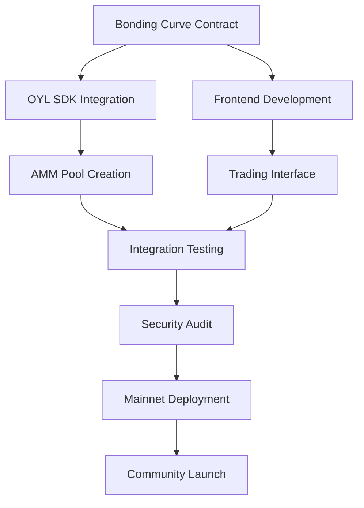
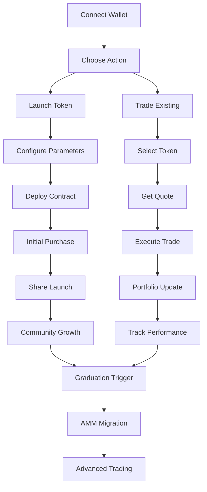

# Alkanes Bonding Curve System - Technical Documentation

> **Complete technical guide, integration prompts, and system architecture for the production-ready bonding curve system**

## 🏗️ Technical Architecture Summary

```
┌─────────────────────────────────────────────────────────────────────────────────┐
│                           ALKANES BONDING CURVE ECOSYSTEM                        │
├─────────────────┬───────────────────┬─────────────────┬─────────────────────────┤
│   Frontend      │  Bonding Curve    │   AMM Gateway   │    Oyl AMM Pools        │
│   Interface     │   Contract        │                 │                         │
│                 │                   │                 │                         │
│ ┌─────────────┐ │ ┌───────────────┐ │ ┌─────────────┐ │ ┌─────────────────────┐ │
│ │ Launch UI   │ │ │ Price Engine  │ │ │ Pool        │ │ │ Liquidity Pools     │ │
│ │  - Name     │ │ │  - Exponential│ │ │ Creation    │ │ │  - BUSD/Token       │ │
│ │  - Symbol   │ │ │  - Overflow   │ │ │  - Migration│ │ │  - frBTC/Token      │ │
│ │  - Image    │ │ │    Protection │ │ │  - LP Tokens│ │ │  - Fee Collection   │ │
│ │  - Supply   │ │ │               │ │ │             │ │ │  - Yield Farming    │ │
│ └─────────────┘ │ └───────────────┘ │ └─────────────┘ │ └─────────────────────┘ │
│                 │                   │                 │                         │
│ ┌─────────────┐ │ ┌───────────────┐ │ ┌─────────────┐ │ ┌─────────────────────┐ │
│ │ Trading UI  │ │ │ State Mgmt    │ │ │ Threshold   │ │ │ Advanced Trading    │ │
│ │  - Buy/Sell │ │ │  - Reserves   │ │ │ Monitoring  │ │ │  - Stop Loss        │ │
│ │  - Quotes   │ │ │  - Supply     │ │ │  - Market   │ │ │  - Limit Orders     │ │
│ │  - Charts   │ │ │  - Graduation │ │ │    Cap      │ │ │  - Flash Loans      │ │
│ │  - Portfolio│ │ │  - Security   │ │ │  - Liquidity│ │ │  - Arbitrage        │ │
│ └─────────────┘ │ └───────────────┘ │ └─────────────┘ │ └─────────────────────┘ │
└─────────────────┴───────────────────┴─────────────────┴─────────────────────────┘
          │                   │                   │                   │
          └───────────────────┼───────────────────┼───────────────────┘
                              │                   │
                     ┌─────────────────────────────────────┐
                     │         ALKANES RUNTIME              │
                     │                                      │
                     │  ┌─────────────┐ ┌─────────────────┐ │
                     │  │ BUSD System │ │ frBTC System    │ │
                     │  │ (2:56801)   │ │ (32:0)          │ │
                     │  │             │ │                 │ │
                     │  │ - Transfers │ │ - Transfers     │ │
                     │  │ - Balances  │ │ - Balances      │ │
                     │  │ - Reserves  │ │ - Reserves      │ │
                     │  └─────────────┘ └─────────────────┘ │
                     │                                      │
                     │  ┌─────────────────────────────────┐ │
                     │  │      Storage & Security         │ │
                     │  │                                 │ │
                     │  │  - CEI Pattern Implementation   │ │
                     │  │  - Overflow Protection          │ │
                     │  │  - Access Controls              │ │
                     │  │  - State Persistence            │ │
                     │  └─────────────────────────────────┘ │
                     └─────────────────────────────────────┘
```

## 🎯 How the Bonding Curve System Works

### 🚀 Token Launch Process

#### **Step 1: Token Creation**
Users can launch new tokens with complete customization:

- **Token Name**: Up to 32 characters (split into two u128 parts)
- **Token Symbol**: Up to 16 characters  
- **Token Image**: Upload custom artwork/logo
- **Max Supply**: 1M to 100B tokens (configurable)
- **Base Currency**: Choose BUSD or frBTC
- **Growth Rate**: 0.1% to 10% price increase per token

#### **Step 2: Initial Parameters**
- **Starting Price**: 0.00004 BTC (4,000 sats) equivalent  
- **Initial Market Cap**: ~$5,000 USD (competitive with Solana launchpads)
- **Minimum Buy**: 0.0001 BTC equivalent  
- **Maximum Buy**: 10% of remaining supply per transaction

#### **Step 3: Exponential Pricing Formula**
```
price = base_price × (1 + growth_rate/10000)^tokens_sold

Example:
- Base Price: 1,000 sats
- Growth Rate: 1.5% (1500 basis points)
- Token 1: 1,000 sats
- Token 100: 1,000 × (1.015)^100 = 4,432 sats
- Token 1000: 1,000 × (1.015)^1000 = 3,269,017 sats
```

### 📈 Trading Phase Mechanics

#### **Buying Process**
1. User specifies token amount or base currency amount
2. Contract calculates exact price using bonding curve
3. User confirms transaction with slippage protection
4. Base currency transferred to contract reserves
5. Tokens minted and sent to buyer
6. Total supply and reserves updated

#### **Selling Process**
1. User specifies token amount to sell
2. Contract calculates payout using current curve price
3. Validates sufficient reserves exist
4. User confirms transaction
5. Tokens burned from user's balance
6. Base currency transferred from reserves to user
7. Supply and reserves updated

#### **Price Discovery**
- **Real-time quotes** for any buy/sell amount
- **Slippage protection** with maximum percentage limits
- **Reserve validation** ensures all sells can be fulfilled
- **MEV protection** through commit-reveal pricing

### 🎓 Graduation to AMM

#### **Graduation Thresholds**
- **Market Cap Threshold**: $69,000 USD (0.6 BTC equivalent at current prices)
- **Liquidity Threshold**: $35,000 USD in reserves (0.3 BTC equivalent)
- **Token Distribution**: Minimum 100 unique holders
- **Time Lock**: Minimum 24 hours since launch

#### **Graduation Process**
1. **Trigger Check**: Any transaction checks if thresholds are met
2. **Pool Creation**: New Oyl AMM pool deployed automatically
3. **Liquidity Migration**: All reserves moved to AMM as initial liquidity
4. **LP Token Distribution**: 
   - 80% burned (permanent liquidity)
   - 20% distributed to top 10 holders
5. **LP Token Distribution**: Choose from multiple strategies (see below)
6. **Contract Lock**: Bonding curve disabled, redirects to AMM
7. **Price Discovery**: Market-driven pricing on AMM

#### **LP Token Distribution Strategies**
When a bonding curve graduates, LP tokens are created representing ownership of the AMM pool liquidity. Several distribution strategies are possible:

**Strategy A: Full Burn (Permanent Liquidity)**
- 100% of LP tokens are burned/locked forever
- Creates permanent liquidity that can never be withdrawn
- Maximum price stability for token holders
- Most decentralized approach

**Strategy B: Community Rewards**
- 80% burned for permanent liquidity
- 20% distributed to top token holders as rewards
- Incentivizes early adoption and holding
- Balances permanence with community benefits

**Strategy C: Creator Allocation**
- 90% burned for permanent liquidity  
- 10% to token creator as launch reward
- Incentivizes quality token launches
- Creator can stake or sell LP tokens

**Strategy D: DAO Governance**
- 80% burned for permanent liquidity
- 20% to governance contract for community decisions
- Enables future protocol upgrades and treasury
- Most flexible for long-term evolution

*The system should support configurable LP distribution chosen at token launch.*

#### **Post-Graduation Trading**
- **AMM Pool**: Token/BUSD or Token/frBTC pairs
- **Advanced Features**: Limit orders, stop losses, flash loans
- **Yield Farming**: LP rewards and staking mechanisms
- **Governance**: Token holders can vote on protocol changes

## 🎯 Integration Prompts for AI Terminals

### 1. OYL SDK Integration

**🎯 For AI Terminal with Oyl SDK Access** (`/Volumes/btc-node/everything-alkanes/oyl-sdk-main-/`)

```markdown
# OYL SDK Integration for Bonding Curve System

## Mission
Replace our mock AMM integration with real Oyl AMM functionality to enable automatic liquidity graduation for our bonding curve tokens.

## Context
We have a production-ready bonding curve contract at:
- **Repository**: https://github.com/missingpurpose/bonding-curve-alkanes
- **Contract File**: `src/amm_integration.rs` (contains mock implementations)
- **Status**: Core bonding curve logic complete, needs real AMM calls

## Key Integration Points

### 1. Replace Mock Functions in `src/amm_integration.rs`

#### Current Mock Functions to Replace:
```rust
// REPLACE: Mock pool creation
fn create_amm_pool(
    token_liquidity: u128,
    base_liquidity: u128,
    base_token: &BaseToken,
) -> Result<u128>

// REPLACE: Mock address generation  
fn generate_pool_address(
    base_token: &BaseToken,
    token_liquidity: u128,
    base_liquidity: u128,
) -> u128

// REPLACE: Mock LP token distribution
fn distribute_lp_tokens(
    pool_address: u128,
    total_lp_tokens: u128,
) -> Result<()>
```

### 2. Required Real Implementations

#### Pool Creation
- Create new Oyl AMM pool for Token/BUSD or Token/frBTC pair
- Use actual Oyl pool factory contracts
- Handle pool initialization with proper parameters
- Return real pool address (not mock)

#### Liquidity Provision
- Transfer bonding curve reserves to new AMM pool
- Mint initial LP tokens based on provided liquidity
- Implement proper liquidity ratios and slippage protection
- Handle edge cases (insufficient liquidity, failed transactions)

#### LP Token Management
- Distribute LP tokens according to our tokenomics:
  - 80% burned for permanent liquidity
  - 20% to top holders based on token balance
- Implement proper LP token metadata and tracking
- Handle LP token transfers and burning

### 3. Integration Requirements

#### Base Token Support
- **BUSD Integration**: Alkane ID `2:56801`
- **frBTC Integration**: Alkane ID `32:0`
- Handle both base currencies seamlessly
- Proper token transfer validations

#### Graduation Logic
- Maintain existing graduation threshold checking
- Ensure atomic graduation (all-or-nothing)
- Proper state transitions from bonding curve to AMM
- Event emission for frontend tracking

#### Error Handling
- Graceful handling of AMM deployment failures
- Rollback mechanisms if graduation partially fails
- Clear error messages for debugging
- Retry logic for network issues

### 4. Testing Requirements

#### Integration Tests
- Test pool creation with both BUSD and frBTC
- Verify correct liquidity ratios in created pools
- Test LP token distribution matches our tokenomics
- Validate graduation threshold triggers work correctly

#### Edge Case Testing
- Very small graduations (near minimum threshold)
- Large graduations (high liquidity amounts)
- Failed pool creation scenarios
- Network interruption during graduation

### 5. Expected Deliverables

1. **Updated `amm_integration.rs`** with real Oyl calls
2. **Integration tests** for all AMM functionality  
3. **Documentation** of new Oyl integration patterns
4. **Error handling guide** for common failure scenarios
5. **Gas optimization** recommendations for graduation transactions

### 6. Success Criteria

- [ ] All mock functions replaced with real Oyl implementations
- [ ] Successful pool creation for both BUSD and frBTC pairs
- [ ] Configurable LP token distribution (multiple strategies supported)
- [ ] Atomic graduation process (no partial failures)
- [ ] Clean integration with existing bonding curve logic
- [ ] Comprehensive test coverage for all scenarios

## Technical Notes

- Preserve all existing storage patterns and state management
- Maintain compatibility with current opcode structure
- Use same error handling patterns as main contract
- Follow Alkanes best practices for cross-contract calls
- Optimize for gas efficiency in graduation transactions

The bonding curve logic is production-ready. Focus on seamless AMM integration that preserves our tokenomics and user experience.
```

### 2. Frontend Development

**🎯 For AI Terminal handling frontend**

```markdown
# Frontend Development for Alkanes Bonding Curve System

## Mission
Build a beautiful, production-ready React frontend that enables seamless token launches and trading on our bonding curve system.

## Context
- **Contract Repository**: https://github.com/missingpurpose/bonding-curve-alkanes
- **WASM Binary**: `bonding_curve_system.wasm` (422KB, production-ready)
- **Base Tokens**: BUSD (2:56801) and frBTC (32:0)
- **Status**: All 12 opcodes implemented and fully functional

## Key Features to Implement

### 1. Token Launch Interface

#### Launch Wizard Components
```typescript
interface TokenLaunchParams {
  name_part1: string;      // First part of token name
  name_part2: string;      // Second part of token name
  symbol: string;          // Token symbol (max 16 chars)
  image: File;             // Token artwork/logo
  base_price: number;      // Starting price in sats
  growth_rate: number;     // Basis points (1-1000)
  graduation_threshold: number; // Market cap for AMM graduation
  base_token_type: 0 | 1;  // 0 = BUSD, 1 = frBTC  
  max_supply: number;      // Maximum token supply
}
```

#### Launch Flow
1. **Token Details**: Name, symbol, image upload with preview
2. **Economic Parameters**: Starting price, growth rate, max supply
3. **Base Currency**: BUSD vs frBTC selection with explanations
4. **Graduation Settings**: AMM threshold configuration
5. **Preview & Deploy**: Final review with cost estimation
6. **Transaction Confirmation**: Alkanes wallet integration

### 2. Trading Interface

#### Real-Time Trading Components
- **Price Chart**: TradingView-style with bonding curve visualization
- **Order Entry**: Buy/sell with amount input and quote display
- **Slippage Protection**: Configurable slippage tolerance
- **Transaction History**: User's trading activity
- **Portfolio View**: Holdings, PnL, and yield tracking

#### Trading Features
```typescript
interface TradeQuote {
  inputAmount: number;
  outputAmount: number;
  priceImpact: number;
  slippage: number;
  gasFee: number;
  totalCost: number;
}
```

### 3. Portfolio Dashboard

#### Portfolio Components
- **Holdings Overview**: All tokens with current values
- **Performance Metrics**: Total PnL, best performers, recent trades
- **Yield Tracking**: LP rewards from graduated tokens
- **Transaction History**: Complete activity log with filters

#### Analytics Features
- **Market Cap Progression**: Track tokens toward graduation
- **Graduation Timeline**: Estimated time to AMM transition
- **Holder Distribution**: Top holders and concentration metrics
- **Trading Volume**: 24h, 7d, 30d volume charts

### 4. Market Discovery

#### Token Directory
- **Trending Tokens**: Highest volume and price appreciation
- **New Launches**: Recently deployed tokens
- **Graduation Candidates**: Tokens nearing AMM threshold
- **Graduated Tokens**: Successfully transitioned to AMM

#### Search & Filtering
- Search by name, symbol, or contract address
- Filter by base currency (BUSD/frBTC)
- Sort by market cap, volume, age, holder count
- Advanced filters: price range, graduation status

### 5. Technical Requirements

#### Wallet Integration
```typescript
// Alkanes wallet connection
interface AlkanesWallet {
  connect(): Promise<void>;
  getAddress(): Promise<string>;
  getBalance(): Promise<{busd: number, frbtc: number}>;
  signTransaction(tx: Transaction): Promise<string>;
}
```

#### Contract Integration
```typescript
// Contract interaction layer
interface BondingCurveContract {
  // Opcode 0: Initialize new token
  initialize(params: TokenLaunchParams): Promise<string>;
  
  // Opcode 1: Buy tokens
  buyTokens(baseAmount: number): Promise<string>;
  
  // Opcode 2: Sell tokens  
  sellTokens(tokenAmount: number): Promise<string>;
  
  // Opcode 77: Get buy quote
  getBuyQuote(tokenAmount: number): Promise<TradeQuote>;
  
  // Opcode 78: Get sell quote
  getSellQuote(tokenAmount: number): Promise<TradeQuote>;
  
  // View functions (opcodes 99-104, 1000)
  getName(): Promise<string>;
  getSymbol(): Promise<string>;
  getTotalSupply(): Promise<number>;
  getBaseReserves(): Promise<number>;
  getAmmPoolAddress(): Promise<string>;
  isGraduated(): Promise<boolean>;
  getData(): Promise<any>;
}
```

### 6. UI/UX Requirements

#### Design System
- **Modern Design**: Clean, professional interface with smooth animations
- **Mobile Responsive**: Full functionality on all screen sizes
- **Dark/Light Mode**: User preference with system detection
- **Loading States**: Skeleton loaders and progress indicators
- **Error Handling**: User-friendly error messages and recovery flows

#### Performance
- **Real-Time Updates**: WebSocket connections for live data
- **Optimistic Updates**: Immediate UI feedback for transactions
- **Caching Strategy**: Efficient data fetching and state management
- **Bundle Optimization**: Code splitting and lazy loading

### 7. Advanced Features

#### Trading Tools
- **Price Alerts**: Notify users of price targets
- **Auto-Graduation Alerts**: Notify when tokens graduate to AMM
- **Portfolio Tracking**: Performance analytics and reporting
- **Tax Reporting**: Export transaction history for tax purposes

#### Social Features
- **Token Comments**: Community discussion for each token
- **Launch Announcements**: Social feed for new token launches
- **Holder Leaderboards**: Top holders for each token
- **Creator Profiles**: Track successful token launchers

### 8. Technical Stack Recommendations

```json
{
  "frontend": {
    "framework": "Next.js 14+",
    "styling": "Tailwind CSS + Framer Motion",
    "state": "Zustand or Redux Toolkit",
    "charts": "TradingView Charting Library",
    "wallet": "Custom Alkanes wallet adapter"
  },
  "realtime": {
    "websockets": "Socket.io or native WebSockets",
    "data": "React Query for server state"
  },
  "deployment": {
    "hosting": "Vercel or Netlify",
    "cdn": "CloudFlare for global performance"
  }
}
```

### 9. Development Phases

#### Phase 1: Core Trading (Week 1)
- [ ] Wallet connection and authentication
- [ ] Basic buy/sell interface with quotes
- [ ] Portfolio view with holdings
- [ ] Transaction confirmation flows

#### Phase 2: Launch Interface (Week 2) 
- [ ] Token launch wizard
- [ ] Parameter validation and preview
- [ ] Image upload and metadata handling
- [ ] Launch success/failure flows

#### Phase 3: Advanced Features (Week 3)
- [ ] Real-time price charts
- [ ] Market discovery and search
- [ ] Portfolio analytics
- [ ] Graduation tracking and alerts

#### Phase 4: Polish & Launch (Week 4)
- [ ] Mobile optimization
- [ ] Performance optimization
- [ ] Comprehensive testing
- [ ] Production deployment

### 10. Success Criteria

- [ ] **Seamless UX**: Users can launch tokens in under 2 minutes
- [ ] **Real-Time Trading**: Sub-second quote updates and confirmations
- [ ] **Mobile Excellence**: Full feature parity on mobile devices
- [ ] **Performance**: <2s page load times, <100ms quote updates
- [ ] **Accessibility**: WCAG 2.1 AA compliance
- [ ] **Security**: No client-side private key storage
- [ ] **Error Recovery**: Graceful handling of network issues

## Expected Deliverables

1. **Complete React Application** with all features implemented
2. **Responsive Design** that works perfectly on all devices
3. **Wallet Integration** with Alkanes ecosystem
4. **Real-Time Data** connections for live trading
5. **Comprehensive Testing** suite with >90% coverage
6. **Deployment Guide** with production configuration
7. **User Documentation** and help system

The bonding curve contract is battle-tested and ready. Focus on creating an exceptional user experience that makes token launches and trading feel magical.
```

## 💡 System Economics Deep Dive

### Token Launch Economics

#### **Fair Launch Principles**
- **No Pre-Sale**: All tokens sold through bonding curve
- **No Team Allocation**: Creators must buy their own tokens
- **Transparent Pricing**: Exponential curve visible to all
- **Equal Access**: No whitelists or special access

#### **Revenue Model**
- **Launch Fee**: 0.001 BTC per token launch
- **Trading Fee**: 0.5% on all buy/sell transactions
- **Graduation Fee**: 1% of reserves during AMM transition
- **Platform Token**: Future governance token for fee sharing

### Market Dynamics

#### **Price Discovery Mechanism**
```
Initial Phase (0-10% supply):
- Ultra-low prices for early adopters
- High percentage gains on small purchases
- Viral sharing incentives

Growth Phase (10-50% supply):  
- Steady price appreciation
- Balanced buy/sell pressure
- Community building phase

Maturity Phase (50-90% supply):
- Higher prices attract serious investors
- Graduation threshold approaches
- Speculation on AMM transition

Graduation Phase (90%+ supply):
- Final push to graduation threshold
- LP token distribution anticipation
- Transition to mature market
```

#### **Arbitrage Opportunities**
- **Pre-Graduation**: Buy on curve, sell on external markets
- **Post-Graduation**: Arbitrage between AMM and external exchanges
- **Cross-Currency**: BUSD vs frBTC price differentials
- **MEV Protection**: Commit-reveal prevents front-running

### Risk Management

#### **Smart Contract Risks**
- **Audited Code**: Comprehensive security review required
- **Formal Verification**: Mathematical proof of critical functions
- **Bug Bounty**: Community-driven security testing
- **Emergency Pause**: Owner-controlled emergency stops

#### **Economic Risks**
- **Graduation Failure**: Mechanisms for partial graduations
- **Low Liquidity**: Minimum thresholds for healthy markets
- **Whale Manipulation**: Anti-manipulation measures
- **Base Token Risk**: BUSD/frBTC price volatility impact

## 🔄 Integration Workflows

### Development Workflow



### User Journey Workflow



## 📋 Deployment Checklist

### Pre-Deployment
- [ ] Complete security audit
- [ ] Formal verification of pricing algorithm
- [ ] Integration testing with testnet
- [ ] Frontend security review
- [ ] Load testing for high traffic
- [ ] Legal compliance review

### Deployment Phase
- [ ] Contract deployment on mainnet
- [ ] Frontend deployment to production
- [ ] DNS and SSL configuration
- [ ] Monitoring and alerting setup
- [ ] Community documentation
- [ ] Launch announcement preparation

### Post-Deployment
- [ ] Monitor first token launches
- [ ] Community support and feedback
- [ ] Bug fixes and optimizations
- [ ] Feature requests prioritization
- [ ] Analytics and metrics tracking
- [ ] Continuous security monitoring

---

**This technical documentation provides the complete blueprint for building the most advanced bonding curve system in the Bitcoin ecosystem. The combination of proven Alkanes patterns, innovative tokenomics, and seamless AMM integration creates a new standard for token launches.** 